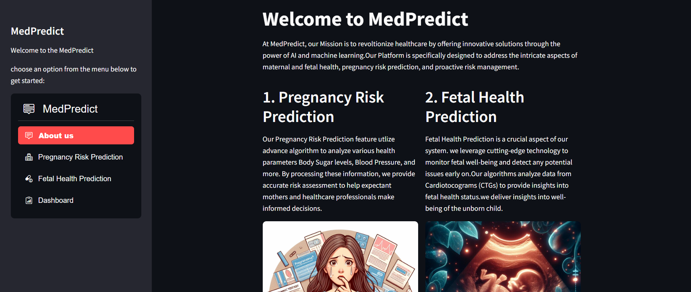
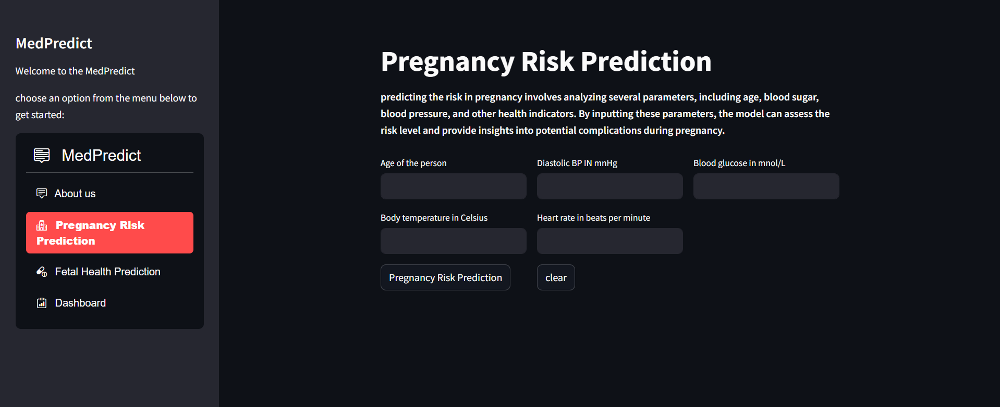
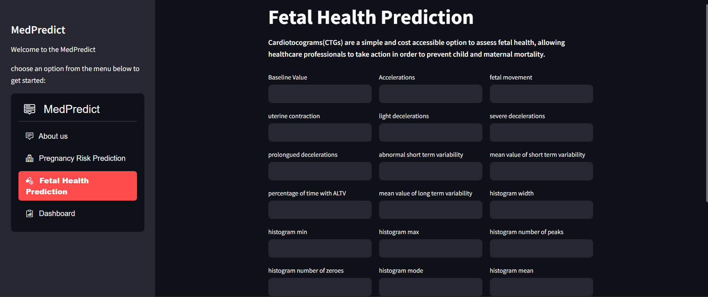
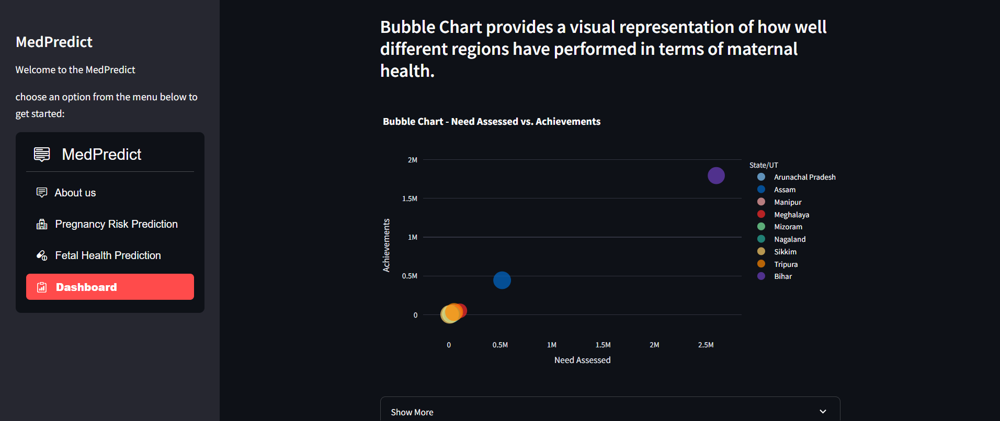

<h1> MedPredict – Smart Platform for Maternal and Fetal Health Insights </h1>
Overview
Welcome to MedPredict, a cutting-edge application designed to support maternal and fetal well-being through predictive healthcare solutions. MedPredict assists medical professionals and users by offering reliable insights and early warnings for pregnancy-related health concerns.

Web Application
Access MedPredict here: MedPredict Webapp

Core Features
Pregnancy Risk Assessment: Using sophisticated machine learning models, our system evaluates vital health indicators such as maternal age, glucose levels, and blood pressure to forecast pregnancy risks and help in timely intervention.

Fetal Health Monitoring: By analyzing cardiotocogram (CTG) data, a low-cost and widely used method, our tool offers vital insights into fetal well-being to help reduce complications and improve outcomes.

Interactive Dashboard: The intuitive dashboard offers a comprehensive view of all predictive outputs. Designed with user-friendliness in mind, it allows for effortless navigation and effective data interpretation by both medical staff and expectant mothers.

Webapp URL
MedPredict: https://medpredict-smart-platform.streamlit.app/

<table>
  <tr>
    <td></td>
    <td></td>
  </tr>
  <tr>
    <td></td>
    <td></td>
  </tr>
</table>

How to Launch the Streamlit App Locally
Here’s how to get started with the local setup:

Step 1: Clone the Repository

git clone https://github.com/your-username/medpredict.git
cd medpredict

Step 2: Install Required Libraries

pip install -r requirements.txt

Step 3: Run the Application

streamlit run main.py

This command will start the Streamlit server. Open the URL shown in your terminal to use MedPredict locally.
